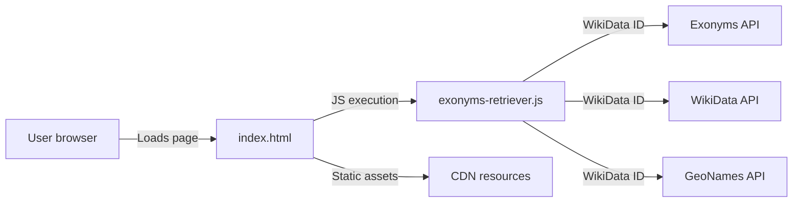
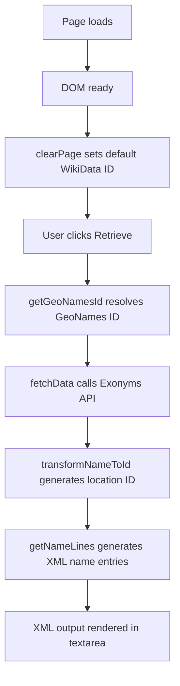
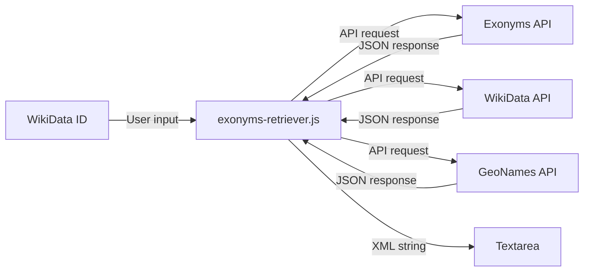
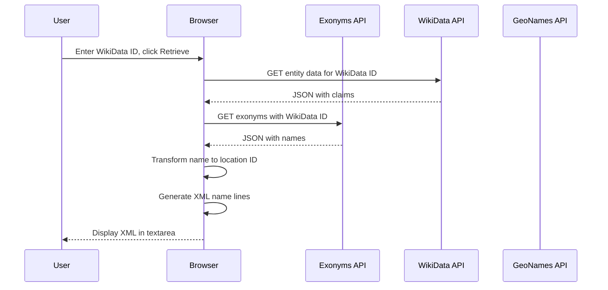
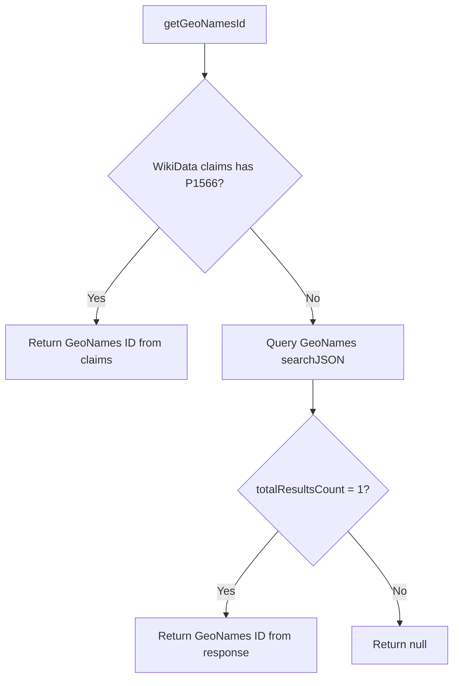
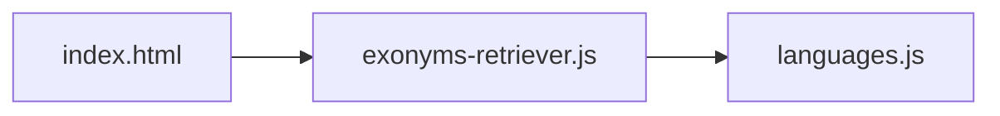

# MCN Exonyms Retriever Architecture

This document describes the current architecture of the MCN Exonyms Retriever, a static client-side web tool that retrieves exonym data for Minecraft locations from public APIs.

## 📑 Table of Contents

- Purpose
- System Context
- Architectural Style
- Runtime Flow
- Architectural Areas
- Data Architecture
- Interfaces and Integrations
- Key Flows
- Cross-Cutting Concerns
- Dependency Direction and Rules
- External Dependencies
- Deployment and Operations
- Design Constraints
- Source Map
- Related Documentation

## 🎯 Purpose

The MCN Exonyms Retriever is a static web application that allows users to retrieve exonym names for a given WikiData location ID and generate an XML snippet compatible with MCN (More Cultural Names) configuration files. The system has no server-side component; all logic executes in the user's browser.

This document is intended for contributors, maintainers, and security reviewers who need to understand the application's structure, data flows, and external dependencies.

## 🌐 System Context

The system is a browser-based static web application. The user interacts with the HTML page in their browser. The application makes outbound HTTP requests to three external APIs and loads static assets from CDNs. No data is stored server-side by this project.

The principal external boundaries are:
- **Exonyms API (`hmlendea.go.ro`):** Outbound request to retrieve exonym names for a WikiData ID. The API returns JSON with localized names.
- **WikiData (`wikidata.org`):** Outbound request to resolve a WikiData entity ID to a GeoNames ID via entity claims.
- **GeoNames (`api.geonames.org`):** Outbound fallback request to resolve a WikiData ID to a GeoNames ID. Uses a shared demo account.
- **CDN resources:** Static assets (jQuery, Bootstrap, Font Awesome, Google Fonts, StartBootstrap) loaded from third-party CDNs.

## 🏗️ Architectural Style

The application follows a **static single-page application (SPA)** style. The entire application is a single HTML file with embedded JavaScript that executes entirely in the browser. There is no server-side rendering, no backend services, and no persistent storage owned by the project.

The principal architecture boundaries are:
- **Presentation layer:** `index.html` — the static HTML page with Bootstrap styling and Font Awesome icons.
- **Application logic:** `js/exonyms-retriever.js` — all data retrieval, transformation, and XML generation logic.
- **Data reference:** `js/languages.js` — a static mapping of language codes to MCN language identifiers.

## 🔄 Runtime Flow

The principal runtime sequence is:
1. The browser loads `index.html` and all CDN resources.
2. On DOM ready, `clearPage()` sets the default WikiData ID (`Q20717572`) and clears the output textarea.
3. The user enters a WikiData ID and clicks **Retrieve**.
4. `retrieveExonyms()` calls `getGeoNamesId()` to resolve the GeoNames ID via WikiData claims or GeoNames fallback.
5. `fetchData()` makes a synchronous `XMLHttpRequest` to the Exonyms API with the WikiData ID and optional GeoNames ID.
6. `transformNameToId()` converts the default name to an MCN-compatible location ID.
7. `getNameLines()` iterates over all languages in `languages.js` and generates XML `<Name>` elements.
8. The generated XML is rendered in the output textarea.

## 🗂️ Architectural Areas

### Presentation Layer

Paths:
- `index.html`

Responsibilities:
- Render the user interface with Bootstrap styling
- Provide input field for WikiData ID
- Display XML output in a textarea
- Wire button click handlers to JavaScript functions

Boundary rules:
- No business logic; all processing delegated to `js/exonyms-retriever.js`
- No inline JavaScript; all scripts loaded externally

### Application Logic

Paths:
- `js/exonyms-retriever.js`

Responsibilities:
- Retrieve exonym data from the Exonyms API
- Resolve WikiData IDs to GeoNames IDs
- Transform location names to MCN-compatible IDs
- Generate XML output

Boundary rules:
- Depends only on `js/languages.js` for language mappings
- Makes no assumptions about DOM structure beyond element IDs defined in `index.html`

### Language Data

Paths:
- `js/languages.js`

Responsibilities:
- Provide a static mapping of language codes to MCN language identifiers

Boundary rules:
- No dependencies on other modules
- Treated as read-only reference data

## 💾 Data Architecture

The application handles no persistent state. All data flows are transient and exist only in browser memory during the session.

| Data or Store | Owner | Representation and Storage | Lifecycle or Consistency |
|---------------|-------|----------------------------|--------------------------|
| WikiData ID | User input | String in DOM input field | Transient; cleared on page reload |
| Exonyms API response | Exonyms API | JSON object | Transient; parsed in memory |
| GeoNames ID | WikiData / GeoNames API | String | Transient; used for API request |
| XML output | exonyms-retriever.js | String in DOM textarea | Transient; cleared on page reload |
| Language mapping | languages.js | JavaScript object constant | Static; loaded at page load |

## 🔌 Interfaces and Integrations

| Interface or Integration | Direction | Contract | Owner | Failure Semantics |
|--------------------------|-----------|----------|-------|-------------------|
| Exonyms API | Outbound | HTTP GET to `https://hmlendea.go.ro/apis/exonyms-api/Exonyms?wikiDataId=Q...` | exonyms-retriever.js | Throws error on non-200 status; caught and logged to console |
| WikiData API | Outbound | HTTP GET to `https://www.wikidata.org/wiki/Special:EntityData/Q....json` | exonyms-retriever.js | Throws error on non-200 status; caught and logged to console |
| GeoNames API | Outbound | HTTP GET to `http://api.geonames.org/searchJSON?username=...&q=Q...` | exonyms-retriever.js | Returns null if no match; caught and logged to console |
| jQuery | Inbound | Loaded from CDN; provides `$` selector and event handling | index.html | Application fails if jQuery fails to load |
| Bootstrap | Inbound | Loaded from CDN; provides CSS and JS components | index.html | UI degrades gracefully if CSS fails to load |

## 🔀 Key Flows

### Exonym Retrieval Flow

This flow resolves the GeoNames ID first (via WikiData claims, falling back to GeoNames search), then fetches exonyms from the Exonyms API, and finally transforms the response into MCN-compatible XML.

### GeoNames ID Resolution Flow

## 🧵 Cross-Cutting Concerns

### Security and Privacy

- The application is static; there is no server-side attack surface.
- All API communication uses HTTPS except the GeoNames API (HTTP only).
- No secrets, credentials, or personal data are embedded in the code.
- The GeoNames demo account (`geonamesfreeaccountt`) is a public shared credential.
- No `localStorage`, `sessionStorage`, `IndexedDB`, or cookies are used.
- See [PRIVACY.md](./PRIVACY.md) for data-handling details.

### Error Handling

- `fetchData()` throws an error on non-200 HTTP status codes.
- `getGeoNamesId()` catches errors and returns `null`, logging to the console.
- `retrieveExonyms()` does not catch errors from `fetchData()` for the Exonyms API call; failures propagate to the browser console.
- Console logging is used for debugging; logs remain in the user's browser.

### Configuration

| Configuration Area | Source | Responsibility | Override or Secret Policy |
|--------------------|--------|----------------|---------------------------|
| API base URLs | `js/exonyms-retriever.js` constants | Define endpoints for Exonyms, WikiData, and GeoNames APIs | Hardcoded; no environment variable support |
| GeoNames username | `js/exonyms-retriever.js` constant | Authenticate GeoNames API requests | Hardcoded shared demo account |
| Default WikiData ID | `index.html` input field default | Pre-populate the input field | User can change at runtime |

## 🧭 Dependency Direction and Rules

The application follows a strict unidirectional dependency:

The principal dependency rules are:
- `index.html` depends on `js/exonyms-retriever.js` and `js/languages.js`
- `js/exonyms-retriever.js` depends on `js/languages.js`
- `js/languages.js` has no dependencies
- No circular dependencies exist

## 📦 External Dependencies

| Dependency | Responsibility | Integration Boundary | Architectural Consequence |
|------------|----------------|----------------------|---------------------------|
| jQuery 3.5.1 | DOM manipulation and event handling | Loaded from `code.jquery.com` CDN | Application fails if CDN is unreachable |
| Bootstrap 4.5.3 | CSS styling and UI components | Loaded from `cdn.jsdelivr.net` CDN | UI degrades if CSS fails to load |
| Font Awesome 6.4.0 | Icon rendering | Loaded from `use.fontawesome.com` CDN | Icons missing if CDN is unreachable |
| Google Fonts | Web fonts (Montserrat, Lato) | Loaded from `fonts.googleapis.com` | Fonts fall back to system defaults |
| StartBootstrap Freelancer | Template CSS and JS | Loaded from `startbootstrap.github.io` | Template styling and scroll behavior |
| WikiData API | Resolve WikiData IDs to GeoNames IDs | `www.wikidata.org` | Public API; no authentication required |
| GeoNames API | Fallback GeoNames ID resolution | `api.geonames.org` | Uses shared demo account; HTTP only |
| Exonyms API | Retrieve exonym names | `hmlendea.go.ro` | Maintainer-operated public API |

## 🚀 Deployment and Operations

The application is deployed as a static website via GitHub Pages. There is no server-side infrastructure, no database, and no persistent storage.

| Concern | Current Design | Architectural Consequence |
|---------|----------------|---------------------------|
| Process topology | Single static HTML page with JavaScript | No server processes to manage |
| Persistent state | None | No database migrations or backups |
| Scaling | Static file hosting | Infinitely scalable via CDN |
| Availability | Dependent on GitHub Pages uptime | No SLA beyond GitHub's infrastructure |
| Recovery | Re-deploy from repository | Full recovery from source control |
| Resource concern | Browser memory only | No server resource limits |

## ⚠️ Design Constraints

- **Synchronous XHR:** `fetchData()` uses synchronous `XMLHttpRequest` (`request.open('GET', url, false)`), which blocks the browser UI during API calls. This is a deliberate trade-off for simplicity.
- **HTTP GeoNames API:** The GeoNames API is loaded over HTTP, not HTTPS, creating a mixed-content risk if the page is served over HTTPS.
- **Shared GeoNames account:** The GeoNames username is a hardcoded shared demo account, which may be rate-limited.
- **No offline support:** The application requires network access to external APIs; no offline caching is implemented.
- **No input validation:** The WikiData ID input is not validated before being used in API requests.

## 🗺️ Source Map

| Area | Path |
|------|------|
| Entry point | `index.html` |
| Application logic | `js/exonyms-retriever.js` |
| Language data | `js/languages.js` |
| License | `LICENSE` |
| Privacy policy | `PRIVACY.md` |
| Security policy | `SECURITY.md` |

## 📚 Related Documentation

- [README.md](./README.md) — Project overview, features, usage instructions, and contributing guidelines.
- [PRIVACY.md](./PRIVACY.md) — Data-handling behaviour and external integrations.
- [SECURITY.md](./SECURITY.md) — Vulnerability reporting and supported versions.