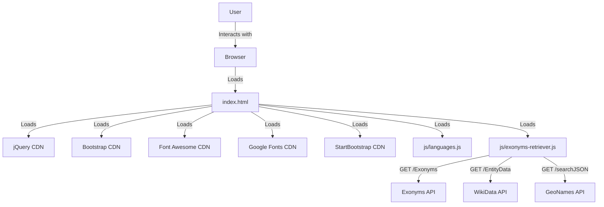
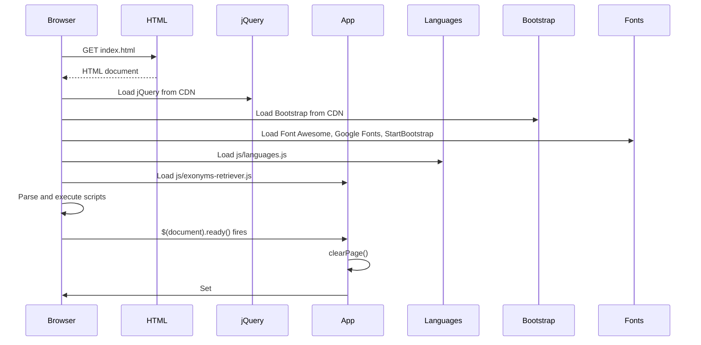
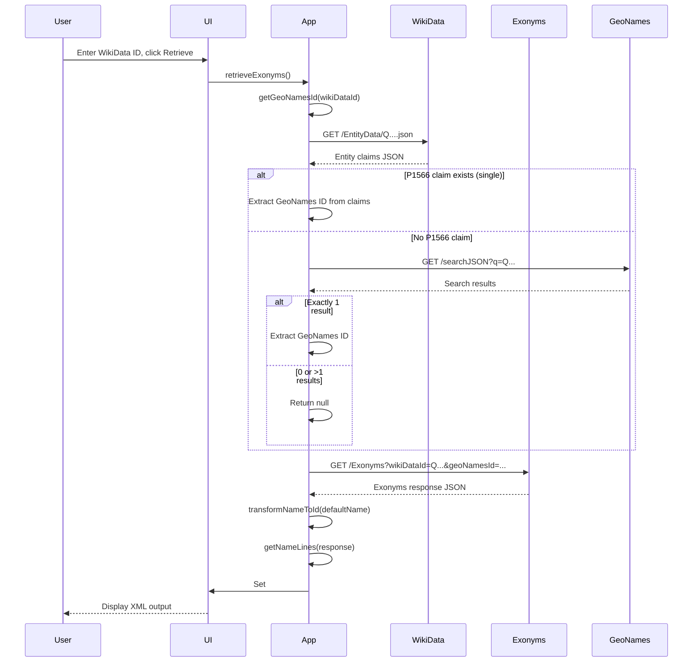

# Architecture

This document complements the root [ARCHITECTURE.md](../ARCHITECTURE.md) with additional implementation detail.

## Architectural style

**Static single-page application (SPA)** — The entire application is a single HTML file with embedded JavaScript that executes entirely in the browser. There is no server-side rendering, no backend services, and no persistent storage owned by the project.

### Style characteristics

| Characteristic | Implementation |
|----------------|----------------|
| Rendering | Server-rendered static HTML; client-side DOM manipulation via jQuery |
| State management | Transient in-memory only; no localStorage, sessionStorage, IndexedDB, or cookies |
| Routing | None (single page) |
| Data fetching | Synchronous XMLHttpRequest (blocking) |
| Module system | Global namespace via script load order; no ES modules, no bundler |
| Build step | None (direct deployment of source files) |

### Consequences

- **Zero server infrastructure** — Deployable to any static host (GitHub Pages, Netlify, S3, etc.)
- **No build pipeline** — Source files are production files
- **Blocking UI during API calls** — Synchronous XHR freezes the browser until responses arrive
- **No offline support** — Requires network connectivity for all operations
- **CDN dependency** — UI framework and fonts loaded from third-party CDNs

## System context (detailed)



### Trust boundaries

| Boundary | Trust level | Data exchanged |
|----------|-------------|----------------|
| User ↔ Browser | Full trust | User input (WikiData ID), displayed output |
| Browser ↔ Exonyms API | Partial trust | WikiData ID, GeoNames ID (public); receives exonym names |
| Browser ↔ WikiData API | Public API | WikiData ID (public); receives entity claims |
| Browser ↔ GeoNames API | Low trust (HTTP, shared demo account) | WikiData ID (public); receives GeoNames ID |
| Browser ↔ CDNs | Partial trust | Static assets (JS, CSS, fonts); no user data |

## Component architecture

### Presentation layer (`index.html`)

**Responsibility:** Render UI, wire event handlers, load dependencies

**Structure:**
- Navigation bar with GitHub link and More Cultural Names link
- Input section: WikiData ID text field (pre-filled with `Q20717572`)
- Output section: Read-only textarea for XML (24 rows)
- Action buttons: Retrieve, Clear, Copy

**Event wiring:** Inline `onclick` attributes on button spans:
- `onclick="retrieveExonyms()"`
- `onclick="clearPage()"`
- `onclick="copyLocation()"`

**No business logic** — All processing delegated to `exonyms-retriever.js`

### Application logic (`js/exonyms-retriever.js`)

**Responsibility:** API orchestration, data transformation, XML generation

**Exported functions (global scope):**

| Function | Purpose |
|----------|---------|
| `clearPage()` | Reset input to default WikiData ID, clear output |
| `retrieveExonyms()` | Main entry point: orchestrate GeoNames resolution → Exonyms API → XML generation |
| `copyLocation()` | Copy textarea content to clipboard |
| `getGeoNamesId(wikiDataId)` | Resolve WikiData ID → GeoNames ID via WikiData claims or GeoNames search |
| `transformNameToId(name)` | Convert default name to MCN-compatible location ID |
| `getName(response, languageCode)` | Extract exonym name for a language code |
| `getNameLine(response, mcnId, languageCode)` | Generate single `<Name>` XML element |
| `getNameLine2variants(...)` | Generate XML for language variant pairs |
| `getNameLines(response)` | Generate all `<Name>` elements for all languages |
| `fetchData(url)` | Synchronous XHR GET with error throwing |
| `isSingleElementArray(obj, prop)` | Utility: check if property is single-element array |

**Internal constants:**
- `exonymsApiBaseUrl` — `https://hmlendea.go.ro/apis/exonyms-api`
- `wikiDataBaseUrl` — `https://www.wikidata.org`
- `geoNamesBaseUrl` — `http://api.geonames.org`
- `geoNamesUsername` — `geonamesfreeaccountt`

### Language data (`js/languages.js`)

**Responsibility:** Static mapping of language codes to MCN language identifiers

**Export:** `languages` object with ~200 entries mapping ISO 639 codes to MCN identifiers

**Special handling in `getNameLines()`:** 10 explicit variant pairs for languages with multiple codes:
- Belarussian (be-tarask / be)
- Bosnian / SerboCroatian (bs / sh)
- Chinese (zh-hans / zh)
- Croatian / SerboCroatian (hr / sh)
- Kurdish (ku / ckd)
- Norwegian Nynorsk / Norwegian (nn / nb)
- Portuguese Brazilian / Portuguese (pt-br / pt)
- Serbian Latin / SerboCroatian (sr-el / sh)
- Serbian Cyrillic / SerboCroatian (sr / sh)

## Runtime flow (detailed)

### Startup sequence



### Exonym retrieval sequence



## Data flow

```
User Input (WikiData ID)
        │
        ▼
getGeoNamesId()
        │
        ├── WikiData API ───► Entity claims (P1566) ───► GeoNames ID
        │
        └── GeoNames API ───► Search results ───► GeoNames ID (fallback)
        │
        ▼
Exonyms API (with WikiData ID + optional GeoNames ID)
        │
        ▼
Exonyms Response JSON
        │
        ├── defaultName ──► transformNameToId() ──► locationId
        │
        └── names[languageCode] ──► getNameLines() ──► XML <Name> elements
        │
        ▼
XML Assembly ──► <LocationEntity> with Id, GeoNamesId, WikiDataId, GameIds, Names
        │
        ▼
DOM Update ──► #location textarea
```

## Deployment architecture

| Aspect | Detail |
|--------|--------|
| Deployment model | Static files served via GitHub Pages |
| Build process | None (source = production) |
| CI/CD | GitHub Actions (if configured) |
| Environments | Single production environment (GitHub Pages) |
| Scaling | Handled by GitHub Pages CDN |
| Rollback | Git revert + push |
| Monitoring | None (static hosting) |

## Security architecture

- **No server-side attack surface** — Static files only
- **Content Security Policy** — Not currently implemented (would require `script-src` for inline event handlers)
- **Mixed content** — GeoNames API uses HTTP; page served via HTTPS on GitHub Pages
- **No authentication** — All APIs are public
- **No secrets in code** — GeoNames username is a public demo account
- **XSS risk** — User input (WikiData ID) directly interpolated into API URLs; no validation/sanitisation
- **Supply chain** — 5 CDN dependencies with no integrity hashes

See [SECURITY.md](../SECURITY.md) and [PRIVACY.md](../PRIVACY.md) for policies.